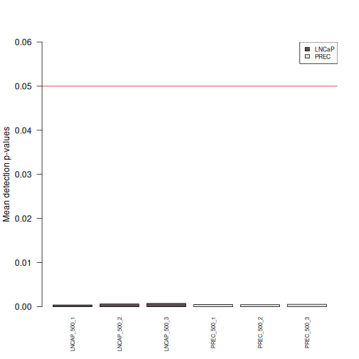
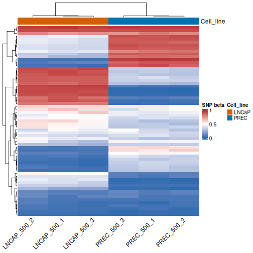
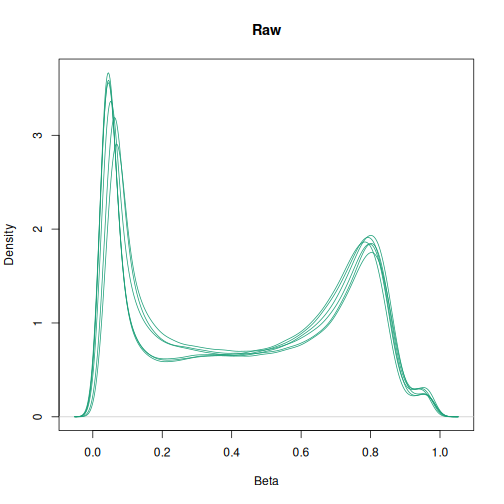
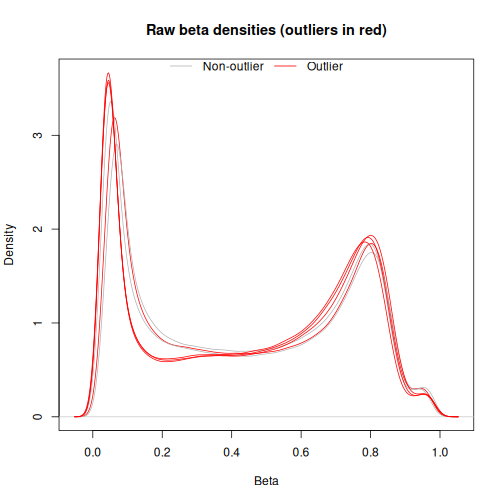
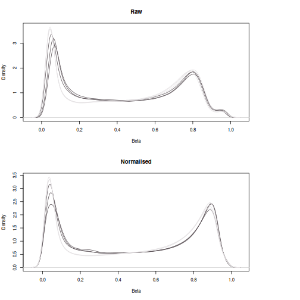
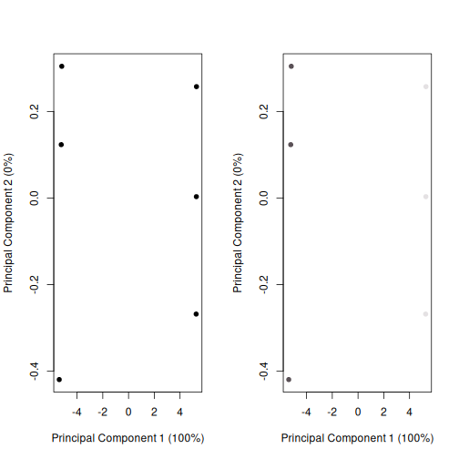
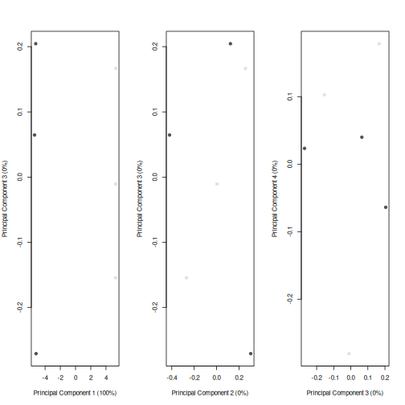
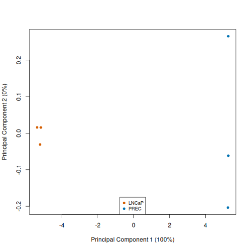

::::::::::::::::::::::::::::::::::::: questions

- Why should we filter poor-quality samples and unreliable probes before differential methylation analysis?
- What do detection p-values tell us about methylation array quality?
- How can density and MDS plots help us identify unusual samples and unwanted variation?
- How can biological differences, sample preparation and array batch affect methylation profiles?
- Why do we normalise methylation array data, and why use functional normalisation for this comparison?
- Why might we exclude probes based on chromosome location, SNPs or cross-reactivity?
- How can we assess the effects of normalisation and filtering without mistaking biological differences for technical variation?

::::::::::::::::::::::::::::::::::::::::::::::::

::::::::::::::::::::::::::::::::::::: objectives

- Calculate and interpret detection p-values to assess sample and probe quality
- Apply sample and probe filters while keeping methylation measurements and sample metadata aligned
- Create and interpret beta-value density plots and MDS plots to explore sample relationships and potential quality problems
- Distinguish possible biological differences from variation associated with sample preparation or array batch
- Perform functional normalisation and explain why it suits a cancer–normal comparison
- Explain the rationale and limitations of chromosome, SNP and cross-reactivity filters
- Compare plots before and after processing to assess changes in methylation distributions and sample relationships
- Recognise when batch effects or confounding require further investigation beyond normalisation

::::::::::::::::::::::::::::::::::::::::::::::::


## Quality control

A detection p-value measures whether a probe's signal can be distinguished from
background. Smaller values support detectable signal. 

We calculate the detection p-values (`detP`) and examine their mean across
probes for each sample to identify potentially failed samples. The red line marks a mean detection p-value of 0.05.
The PDF report provides additional sample quality information.


``` r
detP <- detectionP(rgSet)
head(detP)
```

``` output
                LNCAP_500_1 LNCAP_500_2 LNCAP_500_3 PREC_500_1 PREC_500_2
cg25324105_BC11           0           0           0          0          0
cg25383568_TC11           0           0           0          0          0
cg25455143_BC11           0           0           0          0          0
cg25459778_BC11           0           0           0          0          0
cg25487775_BC11           0           0           0          0          0
cg25595446_BC11           0           0           0          0          0
                PREC_500_3
cg25324105_BC11          0
cg25383568_TC11          0
cg25455143_BC11          0
cg25459778_BC11          0
cg25487775_BC11          0
cg25595446_BC11          0
```

``` r
pal <- Polychrome::palette36.colors(36)

barplot(
  colMeans(detP),
  col = pal[factor(targets$Type)],
  las = 2,
  cex.names = 0.6,
  ylab = "Mean detection p-values",
  ylim = c(0, max(0.06, max(colMeans(detP), na.rm = TRUE)))
)
abline(h = 0.05, col = "red")
legend(
  "topright",
  legend = levels(factor(targets$Type)),
  fill = pal[seq_along(levels(factor(targets$Type)))],
  cex = 0.7,
  bg = "white"
)
```



``` r
dir.create("data/figures", recursive = TRUE, showWarnings = FALSE)
qcReport(
  rgSet,
  sampNames = targets$Sample,
  pdf = "data/figures/qcReport_combined_all_samples.pdf"
)
```

``` warning
Warning in type.convert.default(X[[i]], ...): 'as.is' should be specified by
the caller; using TRUE
Warning in type.convert.default(X[[i]], ...): 'as.is' should be specified by
the caller; using TRUE
Warning in type.convert.default(X[[i]], ...): 'as.is' should be specified by
the caller; using TRUE
Warning in type.convert.default(X[[i]], ...): 'as.is' should be specified by
the caller; using TRUE
Warning in type.convert.default(X[[i]], ...): 'as.is' should be specified by
the caller; using TRUE
Warning in type.convert.default(X[[i]], ...): 'as.is' should be specified by
the caller; using TRUE
Warning in type.convert.default(X[[i]], ...): 'as.is' should be specified by
the caller; using TRUE
Warning in type.convert.default(X[[i]], ...): 'as.is' should be specified by
the caller; using TRUE
Warning in type.convert.default(X[[i]], ...): 'as.is' should be specified by
the caller; using TRUE
Warning in type.convert.default(X[[i]], ...): 'as.is' should be specified by
the caller; using TRUE
Warning in type.convert.default(X[[i]], ...): 'as.is' should be specified by
the caller; using TRUE
Warning in type.convert.default(X[[i]], ...): 'as.is' should be specified by
the caller; using TRUE
Warning in type.convert.default(X[[i]], ...): 'as.is' should be specified by
the caller; using TRUE
Warning in type.convert.default(X[[i]], ...): 'as.is' should be specified by
the caller; using TRUE
Warning in type.convert.default(X[[i]], ...): 'as.is' should be specified by
the caller; using TRUE
Warning in type.convert.default(X[[i]], ...): 'as.is' should be specified by
the caller; using TRUE
Warning in type.convert.default(X[[i]], ...): 'as.is' should be specified by
the caller; using TRUE
Warning in type.convert.default(X[[i]], ...): 'as.is' should be specified by
the caller; using TRUE
Warning in type.convert.default(X[[i]], ...): 'as.is' should be specified by
the caller; using TRUE
Warning in type.convert.default(X[[i]], ...): 'as.is' should be specified by
the caller; using TRUE
Warning in type.convert.default(X[[i]], ...): 'as.is' should be specified by
the caller; using TRUE
Warning in type.convert.default(X[[i]], ...): 'as.is' should be specified by
the caller; using TRUE
Warning in type.convert.default(X[[i]], ...): 'as.is' should be specified by
the caller; using TRUE
Warning in type.convert.default(X[[i]], ...): 'as.is' should be specified by
the caller; using TRUE
Warning in type.convert.default(X[[i]], ...): 'as.is' should be specified by
the caller; using TRUE
Warning in type.convert.default(X[[i]], ...): 'as.is' should be specified by
the caller; using TRUE
Warning in type.convert.default(X[[i]], ...): 'as.is' should be specified by
the caller; using TRUE
Warning in type.convert.default(X[[i]], ...): 'as.is' should be specified by
the caller; using TRUE
Warning in type.convert.default(X[[i]], ...): 'as.is' should be specified by
the caller; using TRUE
Warning in type.convert.default(X[[i]], ...): 'as.is' should be specified by
the caller; using TRUE
Warning in type.convert.default(X[[i]], ...): 'as.is' should be specified by
the caller; using TRUE
Warning in type.convert.default(X[[i]], ...): 'as.is' should be specified by
the caller; using TRUE
Warning in type.convert.default(X[[i]], ...): 'as.is' should be specified by
the caller; using TRUE
Warning in type.convert.default(X[[i]], ...): 'as.is' should be specified by
the caller; using TRUE
```

``` output
png 
  2 
```

## Filter poor quality samples

Retain samples with a mean detection p-value below 0.05. Poor quality samples with a detection p-value >0.05 are removed. Subset `rgSet`, `targets` and `detP` together so the sample information for the poor quality samples are removed together. 

This threshold is an example rather than a universal quality standard. A mean
can conceal individual failed probes; inspect the quality report and raw
intensities before making sample exclusion decisions.


``` r
keep <- colMeans(detP) < 0.05
rgSet <- rgSet[,keep]
rgSet
```

``` output
class: RGChannelSet 
dim: 1105209 6 
metadata(0):
assays(2): Green Red
rownames(1105209): 1600157 1600179 ... 99810982 99810990
rowData names(0):
colnames(6): LNCAP_500_1 LNCAP_500_2 ... PREC_500_2 PREC_500_3
colData names(7): Accession Name ... Basename filenames
Annotation
  array: IlluminaHumanMethylationEPICv2
  annotation: 20a1.hg38
```

``` r
targets <- targets[keep,]
targets[,1:5]
```

``` output
   Accession        Name  Type                  Name2      Sample
1 GSM7698438 LNCAP_500_1 LNCaP GSM7698438_LNCAP_500_1 LNCAP_500_1
2 GSM7698446 LNCAP_500_2 LNCaP GSM7698446_LNCAP_500_2 LNCAP_500_2
3 GSM7698462 LNCAP_500_3 LNCaP GSM7698462_LNCAP_500_3 LNCAP_500_3
4 GSM7698435  PREC_500_1  PREC  GSM7698435_PREC_500_1  PREC_500_1
5 GSM7698443  PREC_500_2  PREC  GSM7698443_PREC_500_2  PREC_500_2
6 GSM7698459  PREC_500_3  PREC  GSM7698459_PREC_500_3  PREC_500_3
```

``` r
detP <- detP[,keep]
dim(detP)
```

``` output
[1] 936990      6
```

::::::::::::::::::::::::::::::::::::: challenge

### Sample quality versus probe quality

Why do we subset `targets` and `detP` when we remove a sample from `rgSet`?
Could a sample pass the mean detection p-value filter but still contain failed
probes?

:::::::::::::::::::::::: solution

### Solution

All three objects must describe the same samples in the same order. Otherwise,
we could assign the wrong group to a sample or filter using another sample's
measurements. Yes: averaging can conceal individual failed probes, so we also
apply a probe-level filter later.

:::::::::::::::::::::::::::::::::
::::::::::::::::::::::::::::::::::::::::::::::::

## Explore sample identity with SNP control probes

The EPIC array also contains 65 probes designed to target SNPs which can help investigate sample identity and possible mix-ups. SNP beta values reflect allele signals rather than CpG methylation levels. Here we plot a simple heatmap where rows represent SNP probes and columns represent samples. Samples with similar SNP profiles cluster together. 


``` r
snp_beta <- getSnpBeta(rgSet)
dim(snp_beta)
```

``` output
[1] 65  6
```

``` r
sample_annotation <- ComplexHeatmap::HeatmapAnnotation(
  Cell_line = targets$Type,
  col = list(Cell_line = c(LNCaP = "#D55E00", PREC = "#0072B2"))
)

ComplexHeatmap::draw(ComplexHeatmap::Heatmap(
  snp_beta,
  name = "SNP beta",
  col = circlize::colorRamp2(c(0, 0.5, 1), c("#2166AC", "white", "#B2182B")),
  top_annotation = sample_annotation,
  cluster_rows = TRUE,
  cluster_columns = TRUE,
  show_row_names = FALSE,
  column_names_rot = 45
))
```



## Create a raw MethylSet and inspect outlier peaks

`preprocessRaw()` converts the raw channels to methylated and unmethylated
intensities. Beta values near zero indicate low methylation; values near one
indicate high methylation.

We then filter out any outlier peaks that may skew our results. We do this by counting peaks in each sample's density curve and flagging
samples with more than three peaks for visual inspection. This is a diagnostic
heuristic: peak counts depend on smoothing and can reflect biology. 


``` r
mSetRaw <- preprocessRaw(rgSet)

densityPlot(getBeta(mSetRaw), main = "Raw", legend = FALSE)
```



``` r
find_peaks <- function(x) {
  d <- density(x[!is.na(x)])
  d$x[c(FALSE, diff(diff(d$y) >= 0) < 0)]
}

all_peaks <- apply(getBeta(mSetRaw), 2, function(x) {
  find_peaks(x)
})
table(lengths(all_peaks) > 3)
```

``` output

FALSE  TRUE 
    2     4 
```

``` r
beta_mat <- as.matrix(getBeta(mSetRaw))
is_outlier <- lengths(all_peaks) > 3
peak_outlier_check <- factor(
  ifelse(is_outlier, "Outlier", "Non-outlier"),
  levels = c("Non-outlier", "Outlier")
)
densityPlot(
  beta_mat,
  sampGroups = peak_outlier_check,
  main = "Raw beta densities (outliers in red)",
  legend = FALSE,
  pal = c("grey70", "red")
)
legend(
  "top",
  legend = c("Non-outlier", "Outlier"),
  col = c("grey70", "red"),
  lty = 1,
  horiz = TRUE,
  bty = "n",
  inset = c(0, -0.02)
)
```



Samples identified with outlier peaks have similar distribution to non-outliers. Hence visual inspection does not justify filtering out any samples. 

## Normalisation

Normalisation aims to reduce unwanted technical variation. We perform functional
normalisation, then compare raw and normalised beta-value distributions.

::::::::::::::::::::::::::::::::::::: callout

### Why use functional normalisation here?

LNCaP cancer cells and PrEC normal prostate epithelial cells may have widespread
biological methylation differences. We use `preprocessFunnorm()` because it
uses control-probe information to adjust unwanted variation while aiming to
preserve these global biological differences.

In contrast, `preprocessQuantile()` assumes broadly comparable methylation
distributions and is more appropriate when substantial global differences are
not expected. This choice follows the [minfi preprocessing guidance](https://www.bioconductor.org/help/course-materials/2015/BioC2015/methylation450k.html)
for cancer–normal comparisons; it is a starting guideline rather than a guarantee
that one method is always best.

Compare density plots, MDS and technical-replicate agreement after processing.
The two cell types do not need identical density curves. Normalisation also
does not automatically resolve batch effects or confounding.

::::::::::::::::::::::::::::::::::::::::::::::::


``` r
mSetFn <- preprocessFunnorm(rgSet)
```

``` output
[preprocessFunnorm] Background and dye bias correction with noob
```

``` output
[preprocessFunnorm] Mapping to genome
```

``` output
[preprocessFunnorm] Quantile extraction
```

``` warning
Warning in .getSex(CN = CN, xIndex = xIndex, yIndex = yIndex, cutoff = cutoff):
An inconsistency was encountered while determining sex. One possibility is that
only one sex is present. We recommend further checks, for example with the
plotSex function.
```

``` output
[preprocessFunnorm] Normalization
```

``` r
layout(
  matrix(c(1, 1, 3, 2, 2, 3), 2, 3, byrow = TRUE),
  widths = c(1, 1, 0.3),
  heights = c(1, 1)
)
densityPlot(rgSet, sampGroups = targets$Type, main = "Raw", legend = FALSE, pal = pal)
densityPlot(getBeta(mSetFn), sampGroups = targets$Type, main = "Normalised", legend = FALSE, pal = pal)
par(mar = c(0, 0, 0, 0))
plot.new()
```



## Preliminary visualisation of data with MDS plot

Multidimensional scaling (MDS) summarises similarities between samples using
M-values. `top=1000` and `gene.selection="common"` select the same 1,000 most
variable probes across samples for the plot. 

The first pair of panels shows uncoloured samples and samples coloured by cell line. The next panels examine
higher dimensions, coloured by cell line.


``` r
par(mfrow=c(1,2))
plotMDS(getM(mSetFn), top=1000, gene.selection="common", cex=0.9, pch = 19)

plotMDS(getM(mSetFn), top=1000, gene.selection="common",
        col=pal[factor(targets$Type)], cex=0.9, pch = 19)
```



``` r
# higher dimensions
par(mfrow=c(1,3))
plotMDS(getM(mSetFn), top=1000, gene.selection="common",
        col=pal[factor(targets$Type)], dim=c(1,3), pch = 19)

plotMDS(getM(mSetFn), top=1000, gene.selection="common",
        col=pal[factor(targets$Type)], dim=c(2,3), pch = 19)

plotMDS(getM(mSetFn), top=1000, gene.selection="common",
        col=pal[factor(targets$Type)], dim=c(3,4), pch = 19)
```



Look for grouping by cell line, agreement between replicates and isolated
samples. These plots are exploratory; separation does not identify individual
differentially methylated probes.

## Filter failed or poor quality probes

Remove probes that fail detection in one or more samples. First align
the detection p-value rows with the normalised probe identifiers, then retain
probes with detection p-values below 0.01 in every sample.

This is a stringent rule and becomes more restrictive as sample numbers grow.


``` r
# Ensure probes in same order
detP <- detP[match(featureNames(mSetFn), rownames(detP)), ]
stopifnot(identical(colnames(mSetFn), colnames(detP)))

keep <- rowSums(detP < 0.01) == ncol(mSetFn)
table(keep)
```

``` output
keep
 FALSE   TRUE 
  5936 924139 
```

``` r
mSetFnFlt <- mSetFn[keep, ]
mSetFnFlt
```

``` output
class: GenomicRatioSet 
dim: 924139 6 
metadata(0):
assays(2): Beta CN
rownames(924139): cg00381604_BC11 cg21870274_BC21 ... cg27912920_TC21
  cg16855331_BC21
rowData names(0):
colnames(6): LNCAP_500_1 LNCAP_500_2 ... PREC_500_2 PREC_500_3
colData names(10): Accession Name ... yMed predictedSex
Annotation
  array: IlluminaHumanMethylationEPICv2
  annotation: 20a1.hg38
Preprocessing
  Method: NA
  minfi version: NA
  Manifest version: NA
```
5936 poor quality probes filtered from our methylation dataset. 924139 probes remaining. 

## Filter sex chromosomes

Remove probes annotated to chromosomes X and Y. This is to remove any sex variability in our analysis, not a statement that these measurements
are unreliable. Keep them if your biological question concerns sex chromosomes
and plan the analysis accordingly.


``` r
keep <- !(featureNames(mSetFnFlt) %in%
            epic$Name[epic$chr %in% c("chrX", "chrY")])
table(keep)
```

``` output
keep
 FALSE   TRUE 
 24054 900085 
```

``` r
mSetFnFlt <- mSetFnFlt[keep, ]
mSetFnFlt
```

``` output
class: GenomicRatioSet 
dim: 900085 6 
metadata(0):
assays(2): Beta CN
rownames(900085): cg00381604_BC11 cg21870274_BC21 ... cg26570081_BC21
  cg26570107_TC11
rowData names(0):
colnames(6): LNCAP_500_1 LNCAP_500_2 ... PREC_500_2 PREC_500_3
colData names(10): Accession Name ... yMed predictedSex
Annotation
  array: IlluminaHumanMethylationEPICv2
  annotation: 20a1.hg38
Preprocessing
  Method: NA
  minfi version: NA
  Manifest version: NA
```
24054 probes filtered from our methylation dataset. 9000085 probes remaining. 

## Filter CpGs with SNPs

Variants at the interrogated CpG or single-base extension site can affect the
measurement. Use the matching array annotation to remove loci with annotated
SNPs. 


``` r
mSetFnFlt <- mapToGenome(mSetFnFlt)
mSetFnFlt <- dropLociWithSnps(mSetFnFlt)
mSetFnFlt
```

``` output
class: GenomicRatioSet 
dim: 886487 6 
metadata(0):
assays(2): Beta CN
rownames(886487): cg00381604_BC11 cg21870274_BC21 ... cg26570081_BC21
  cg26570107_TC11
rowData names(0):
colnames(6): LNCAP_500_1 LNCAP_500_2 ... PREC_500_2 PREC_500_3
colData names(10): Accession Name ... yMed predictedSex
Annotation
  array: IlluminaHumanMethylationEPICv2
  annotation: 20a1.hg38
Preprocessing
  Method: NA
  minfi version: NA
  Manifest version: NA
```
886487 probes remain after SNP filtering. 

## Filter CpGs with potential cross-reactivity

Some probes can bind to more than one genomic region. We use the Peters *et al.* EPICv2 manifest from AnnotationHub and
exclude probes flagged by `CH_BLAT` for predicted cross-hybridisation.


``` r
ah <- AnnotationHub()
```

``` r
epicv2_manifest <- ah[["AH116484"]]
```

``` output
downloading 1 resources
```

``` output
retrieving 1 resource
```

``` output
loading from cache
```

``` r
xReactiveProbes <- rownames(epicv2_manifest)[epicv2_manifest$CH_BLAT == "Y"]
keep <- !(featureNames(mSetFnFlt) %in% xReactiveProbes)
table(keep)
```

``` output
keep
 FALSE   TRUE 
 27592 858895 
```

``` r
mSetFnFlt <- mSetFnFlt[keep, ]
mSetFnFlt
```

``` output
class: GenomicRatioSet 
dim: 858895 6 
metadata(0):
assays(2): Beta CN
rownames(858895): cg00002271_BC21 cg00004581_TC21 ... cg13801850_TC21
  cg08423507_BC11
rowData names(0):
colnames(6): LNCAP_500_1 LNCAP_500_2 ... PREC_500_2 PREC_500_3
colData names(10): Accession Name ... yMed predictedSex
Annotation
  array: IlluminaHumanMethylationEPICv2
  annotation: 20a1.hg38
Preprocessing
  Method: NA
  minfi version: NA
  Manifest version: NA
```
27592 cross reactive probes were detected and filtered from our methylation data. 858895 probes remain. 

::::::::::::::::::::::::::::::::::::: callout

### Alternative/additional workflows 

As an alternative to the separate SNP and cross-reactivity filters above,
`DMRcate::rmSNPandCH()` filters a matrix of beta values or M-values. For example,
start with the normalised data after detection filtering:

```r
betaFnFlt <- DMRcate::rmSNPandCH(betaFn)
```

By default, `rmSNPandCH()` filters SNP-associated probes and removes cross-reactive probes (`rmcrosshyb = TRUE`). Sex-chromosome probes
are retained by default; add `rmXY = TRUE` to exclude them too. Its criteria
and annotation resources can differ from the separate `dropLociWithSnps()` and `CH_BLAT` filtering steps used here, so the retained
probe sets need not be identical. See the [DMRcate reference manual](https://www.bioconductor.org/packages/release/bioc/manuals/DMRcate/man/DMRcate.pdf).

EPICv2 includes multiple probes that map to the same CpG site. These are
**replicate probes within an array**, distinct from the technical replicate
samples in this lesson. Keeping multiple measurements per locus can give some
sites extra weight in region analysis. The filters above remove unreliable
probes but do not collapse replicate groups.

Replicate handling is a separate optional step: options include averaging measurements
or selecting a representative probe. In current DMRcate versions,
`cpg.annotate(..., arraytype = "EPICv2", epicv2Filter = "mean")` handles replicate
groups during annotation. Keep complete EPICv2 probe IDs until this step;
removing their suffixes alone does not combine the measurements. 
::::::::::::::::::::::::::::::::::::::::::::::::

## Save files


``` r
dir.create("data/processed", recursive = TRUE, showWarnings = FALSE)

saveRDS(mSetFnFlt, file = "data/processed/normalised-filtered.rds")
saveRDS(targets, file = "data/processed/targets.rds")
```

## Re-examine MDS after filtering

Plot the filtered M-values, to re-visualise the methylation data. 


``` r
dir.create("data/figures", recursive = TRUE, showWarnings = FALSE)
pal <- Polychrome::palette36.colors(30)

# Cell line
cols_type <- c("LNCaP" = "#D55E00", "PREC" = "#0072B2")
f <- factor(targets$Type, levels = names(cols_type))

png(
  filename = "data/figures/mds_cell_line.png",
  width = 8,
  height = 7,
  units = "in",
  res = 300
)
plotMDS(getM(mSetFnFlt), top=1000, gene.selection="common",
        col = cols_type[f], cex=0.8, pch=19)
legend("bottom", legend=names(cols_type), col = cols_type, pch = 19,
       cex=0.8, bg="white")
dev.off()
```

``` output
png 
  2 
```

``` r
plotMDS(getM(mSetFnFlt), top=1000, gene.selection="common",
        col = cols_type[f], cex=0.8, pch=19)
legend("bottom", legend=names(cols_type), col = cols_type, pch = 19,
       cex=0.8, bg="white")
```



Check whether replicates cluster together, whether cell lines separate, and
whether any sample is unusual. The most variable probes can change after
filtering, so the before- and after-filtering plots can be plotting different probes. 
An MDS plot is exploratory and does not identify differentially methylated probes.

::::::::::::::::::::::::::::::::::::: challenge

### Interpret the plots

1. What are some other variables in a given dataset that you would want to explore with MDS?
2. What would you investigate before removing an isolated sample?

:::::::::::::::::::::::: solution

### Solution

1. Other variables that can contribute to differential methylation: sex, batch, age etc
2. Check detection failures, raw intensities, sample labels, experimental
   records and known technical factors. An isolated point can also reflect
   genuine biology; a plot alone is not a sufficient exclusion rule.

:::::::::::::::::::::::::::::::::
::::::::::::::::::::::::::::::::::::::::::::::::

::::::::::::::::::::::::::::::::::::: keypoints

- Calculate detection p-values on raw data and inspect both sample and probe quality.
- Keep metadata, detection p-values and methylation objects aligned by identifier.
- Normalisation assumptions must fit the biological comparison.
- Detection, chromosome, SNP and cross-reactivity filters address different questions.
- Density and MDS plots help identify patterns worth investigating; they do not prove a batch effect or differential methylation.
- Save processed objects and record filtering decisions for reproducible downstream analysis.

::::::::::::::::::::::::::::::::::::::::::::::::
